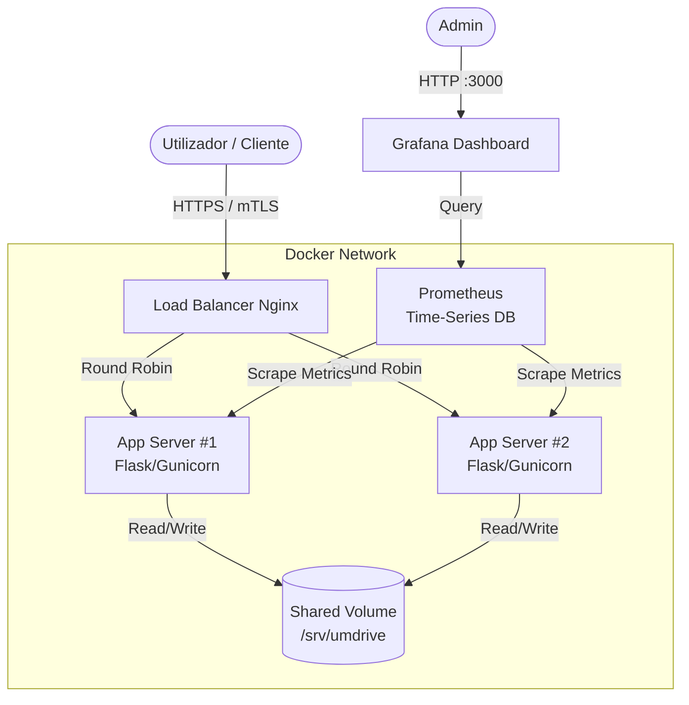

# Arquitetura do Sistema UM Drive

Este documento descreve a arquitetura técnica da solução "UM Drive", desenhada para garantir escalabilidade, segurança e alta disponibilidade.

## 1. Visão Geral da Arquitetura

O sistema segue uma arquitetura **Distribuída e Containerizada**, orquestrada via Docker Compose.

### Diagrama de Componentes

## 2. Componentes Principais

### Frontend & Backend (Monolito Modular)
*   **Tecnologia**: Python Flask + Jinja2 (Serverside Rendering).
*   **Servidor WSGI**: Gunicorn (Production Grade).
*   **Função**: Processa lógica de negócio, autenticação e gestão de ficheiros.
*   **Escalabilidade**: Horizontal. Múltiplos contentores (`app1`, `app2`) correm a mesma imagem.

### Load Balancer & Gateway
*   **Tecnologia**: Nginx.
*   **Função**:
    *   **Terminação SSL**: Gere os certificados HTTPS.
    *   **Load Balancing**: Distribui tráfego entre os servidores de aplicação.
    *   **Segurança**: Impõe autenticação mútua (mTLS) para clientes internos.

### Armazenamento (Persistência)
*   **Tecnologia**: Docker Volume (simulando NFS).
*   **Função**: Garante que um ficheiro carregado no `App1` está imediatamente disponível se o utilizador for redirecionado para o `App2`.

### Observabilidade (Monitorização)
*   **Prometheus**: Recolhe métricas em tempo real (CPU, memória, latência de pedidos HTTP).
*   **Grafana**: Visualização gráfica do estado do sistema.

## 3. Fluxos de Dados

### Upload de Ficheiro
1.  Cliente envia `POST /api/upload` para o Nginx.
2.  Nginx encaminha para `App1`.
3.  `App1` valida requisitos e grava no Volume Partilhado.
4.  Resposta `200 OK` devolvida ao cliente.

### Leitura de Ficheiro (com Falha Simulada)
1.  Cliente pede `GET /download/doc.pdf`.
2.  Nginx tenta contactar `App1` (que está "em baixo" ou ocupado).
3.  Nginx faz *failover* e encaminha para `App2`.
4.  `App2` lê o ficheiro do Volume Partilhado (que foi gravado pelo `App1`).
5.  Cliente recebe o ficheiro sem notar falhas.

## 4. Segurança

*   **HTTPS/TLS 1.2+**: Encriptação em trânsito.
*   **mTLS (Mutual TLS)**: O servidor valida o certificado do cliente. Apenas dispositivos autorizados com o certificado instalado podem aceder.
*   **Isolamento de Contentores**: A rede interna do Docker não é exposta diretamente à internet (exceto portas 80/443 do Nginx).
