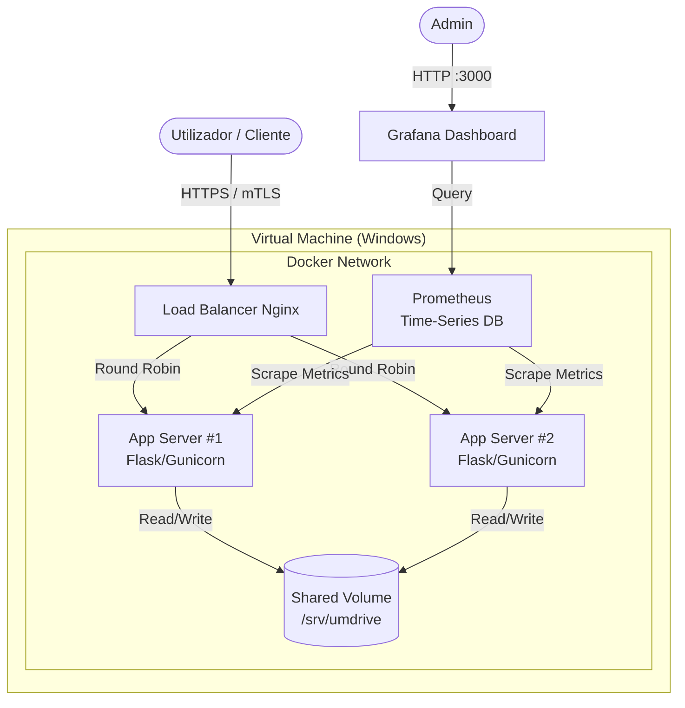

# Arquitetura do Sistema UM Drive

Este documento descreve a arquitetura técnica da solução "UM Drive", desenhada para garantir escalabilidade, segurança e alta disponibilidade.

## 1. Visão Geral da Arquitetura

O sistema segue uma arquitetura híbrida de **Virtualização e Containerização**. A infraestrutura base é composta por **Máquinas Virtuais (VMs)** que hospedam o ambiente Docker, garantindo isolamento do sistema operativo host.

### Diagrama de Componentes

## 2. Componentes Principais

### Infraestrutura (Virtualização)
*   **Tecnologia**: Máquina Virtual (VM).
*   **Função**: Proporciona abstração de hardware e isolamento do sistema operativo (ex: Windows). É onde corre o Docker Engine.

### Rede (VPN)
*   **Função**: Cria uma rede privada virtual para interligar as VMs (que podem estar fisicamente distantes).
*   **Benefícios**:
    *   **IP Estático**: Garante que os IPs não mudam, o que é crucial para a validade dos certificados digitais.
    *   **Segurança**: Encripta todo o tráfego entre nós, mesmo antes do HTTPS.

### Backend (Containerização)
*   **Tecnologia**: Python Flask + Jinja2 (Serverside Rendering).
*   **Servidor WSGI**: Gunicorn (Production Grade).
*   **Função**: Processa lógica de negócio e autenticação.
*   **Escalabilidade**: Horizontal via Docker.

### Load Balancer & Gateway
*   **Tecnologia**: Nginx.
*   **Função**:
    *   **Terminação SSL**: Gere os certificados HTTPS.
    *   **Load Balancing**: Distribui tráfego entre `app1` e `app2`.
    *   **Segurança**: Impõe autenticação mútua (mTLS).

### Armazenamento (Persistência)
*   **Tecnologia**: Docker Volume (a simular NFS).
*   **Função**: Garante que um ficheiro carregado no `App1` está disponível para `App2`.

### Observabilidade (Monitorização)
*   **stack**: Prometheus + Grafana.
*   **Função**: Monitorização de KPI's de sistema e aplicação dentro da VM.

## 3. Fluxos de Dados

### Upload de Ficheiro
1.  Cliente envia `POST /api/upload` para o IP da VPN (estático).
2.  Nginx (na VM) encaminha para `App1`.
3.  `App1` grava no Volume Partilhado.
4.  Resposta `200 OK`.

## 4. Segurança

*   **VPN**: Rede privada sobre a internet pública.
*   **HTTPS/TLS 1.2+** e **mTLS (Mutual TLS)**.
*   **Isolamento de SO**: A VM protege o host físico.
*   **Isolamento de Rede**: A rede Docker protege os serviços.

## 5. Decisões de Design e Justificações

Esta secção detalha o racional por trás das escolhas tecnológicas.

| Decisão | Alternativa | Justificativa da Escolha |
| :--- | :--- | :--- |
| **VPN** | Port Forwarding / IP Público | **Conectividade e Identidade.** A VPN permite conectar máquinas fisicamente distantes na mesma rede lógica. Garante **IPs estáticos**, essenciais para que os certificados e assinaturas digitais funcionem sem serem invalidados por mudanças de rede. |
| **Virtualização (VM)** | Bare Metal | **Isolamento de Sistema.** O uso de uma VM permite gerir o Sistema Operativo (Windows) de forma independente do hardware do estudante, replicando um ambiente corporativo. |
| **Containerização (Docker)** | Instalação Nativa | **Portabilidade.** O Docker corre sobre a VM para garantir que as dependências (Python, Nginx) são imutáveis e fáceis de atualizar sem "sujar" o SO da VM. |
| **Nginx** | HAProxy | **Performance e mTLS.** O Nginx é o standard para Reverse Proxy e suporta nativamente a autenticação por certificados. |
| **Flask + Gunicorn** | Django | **Leveza.** Ideal para microsserviços rápidos. |
| **Volume Partilhado** | S3 | **Conformidade com NFS.** Simula o armazenamento em rede num ambiente local. |
